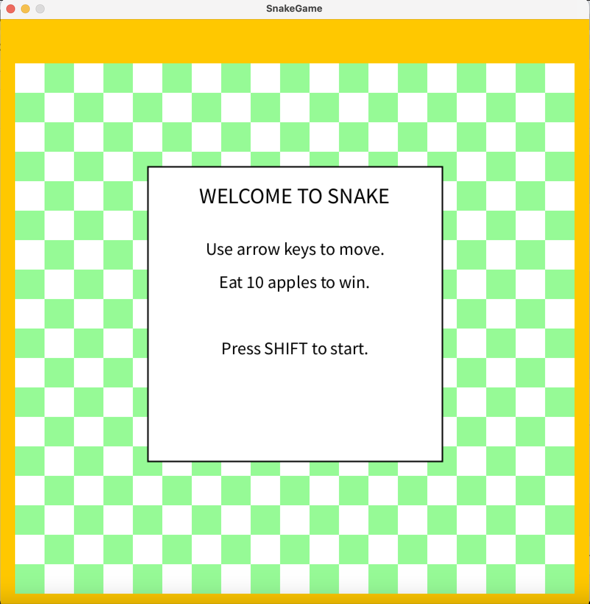
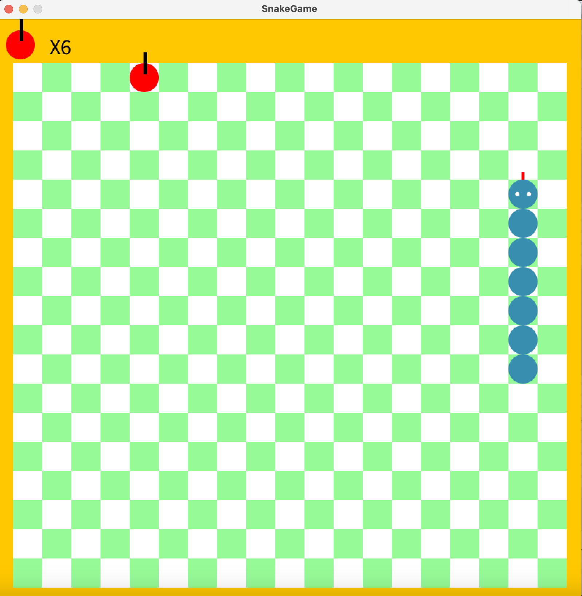
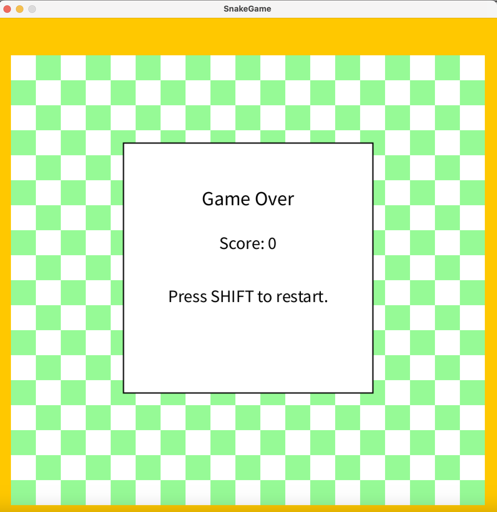

# Snake Game in Processing

## 概要

このプロジェクトは、Processingを用いて実装したクラシックなスネークゲームである。

プレイヤーは矢印キーでヘビを操作し、フィールド上に出現するリンゴを食べてスコアを増やす。壁や自分自身に衝突するとゲームオーバーになり、一定数のリンゴを食べるとゲームクリアとなる。

## 主な機能

* スタート画面の表示
* 矢印キーによるヘビの移動
* リンゴのランダム生成
* リンゴを食べた際のスコア加算
* リンゴを食べた際のヘビの成長
* 壁との衝突判定
* 自己衝突判定
* ゲームオーバー画面
* ゲームクリア画面
* リスタート機能
* 複数クラスによるオブジェクト指向設計

## 操作方法

* 矢印キー：ヘビの移動
* Shiftキー：ゲーム開始 / リスタート

## プロジェクト構成

```text
SnakeGame/
├── SnakeGame.pde
├── Snake.pde
├── Food.pde
└── Game.pde
```

## クラス構成

### Snake

ヘビ本体の管理を行うクラスである。

主な役割：

* ヘビの座標管理
* 移動処理
* 成長処理
* 描画処理
* 壁との衝突判定
* 自己衝突判定

### Food

リンゴの管理を行うクラスである。

主な役割：

* リンゴの座標管理
* リンゴの再配置
* リンゴの描画
* ヘビと重ならない位置への配置

### Game

ゲーム全体の状態管理を行うクラスである。

主な役割：

* スタート画面の表示
* ゲーム中画面の管理
* ゲームオーバー画面の表示
* ゲームクリア画面の表示
* スコア表示
* グリッド描画
* 状態遷移の管理

## 実行方法

1. Processingをインストールする。
2. `SnakeGame/` フォルダをProcessingで開く。
3. `SnakeGame.pde` を開く。
4. Runボタンを押して実行する。

## 使用技術

* Processing
* Object-Oriented Programming


## このプロジェクトで学んだこと

* Processingにおけるゲームループの実装
* キーボード入力処理
* グリッドベースの座標管理
* 衝突判定
* オブジェクト指向プログラミング
* ゲーム状態管理
* コードのリファクタリング

## スクリーンショット

### スタート画面


### プレイ画面


### ゲームオーバー画面

